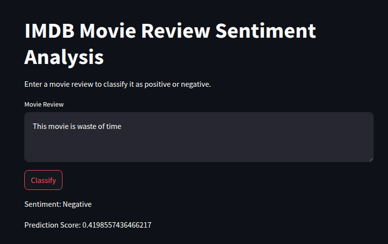

# 🎬 IMDB Movie Review Sentiment Analysis 📊

## 🚀 Overview

Welcome to the **IMDB Movie Review Sentiment Analysis** project! This application leverages a simple Recurrent Neural Network (RNN) to determine whether an IMDB movie review is **positive** or **negative**. Built with **Streamlit**, the app offers an intuitive and interactive user interface, allowing you to input your own reviews and receive instant sentiment predictions. 🎉

---

## ⭐ Features

- **🔍 Sentiment Analysis**: Accurately classifies movie reviews as positive or negative.
- **🖥️ Interactive UI**: Engage with a user-friendly Streamlit web app to input reviews and receive real-time predictions.
- **⚡ Pre-trained Model**: Utilizes a pre-trained RNN model for swift and reliable sentiment analysis.

---

## 🛠️ Installation

### 📋 Prerequisites

- **Python**: Ensure you have Python **3.10+** installed on your system. 🐍

### 🛠️ Creating a Virtual Environment

It's a good practice to create a virtual environment to manage your project's dependencies. Follow the instructions below based on your operating system:

#### 💻 On Windows

1. **Open Command Prompt or PowerShell**.

2. **Navigate to the Project Directory**:

   ```bash
   cd path\to\your\project-directory
   ```

3. **Create a Virtual Environment:**

   ```bash
   python -m venv venv
   ```

4. **Activate the Virtual Environment:**

   - Command Prompt:
     ```bash
     venv\Scripts\activate
     ```

#### 🐧 On Linux

1. Open Terminal.

2. Navigate to the Project Directory:

   ```bash
   cd path/to/your/project-directory
   ```

3. Create a Virtual Environment:

   ```bash
   python3 -m venv venv
   ```

4. Activate the Virtual Environment:

   ```bash
   source venv/bin/activate
   ```

🔔 Note: After activation, your terminal prompt will be prefixed with (venv) indicating that the virtual environment is active.

### 🏁 Steps

1. **Clone the Repository**:

   ```bash
   git clone https://github.com/alphatechlogics/Sentiment-Analysis.git
   cd project-directory
   ```

2. **Install Dependencies**:

   ```bash
   pip install -r requirements.txt
   ```

3. **Run the Streamlit App**:
   ```bash
   streamlit run main.py
   ```

---

## 🖥️ Usage

### 🌐 Streamlit App

1. **Launch the App**: After running `streamlit run main.py`, open the provided link in your browser.
2. **Input Your Review**: Enter a movie review into the text box.
3. **Get Prediction**: Click the **Classify** button to receive your sentiment prediction. 🎯

### 📝 Example Output

- **Sentiment**: Positive 😊 / Negative 😞
- **Prediction Score**: A probability score indicating the model's confidence. 📈

---

## 🧠 Model Details

- **Architecture**: Simple Recurrent Neural Network (RNN) 🤖
- **Dataset**: IMDB Movie Reviews Dataset 📚
- **Preprocessing**: Reviews are tokenized and padded to a fixed length of **500 words**. ✂️
- **Output**: Binary classification indicating **Positive** or **Negative** sentiment. ✅

---

## 📁 File Descriptions

### `main.py`

The primary script to launch the Streamlit app. It includes helper functions for text preprocessing and generating real-time predictions. 🛠️

### `prediction.ipynb`

A Jupyter Notebook used for training and evaluating the RNN model. It encompasses:

- Data loading and preprocessing 📂
- Model architecture and training pipeline 🏗️
- Evaluation metrics 📊

### `simple_rnn_imdb.h5`

The pre-trained RNN model saved in **HDF5** format. This file is essential for making predictions without retraining the model. 💾

### `requirements.txt`

A comprehensive list of dependencies required for the project. Ensure all packages are installed to run the application smoothly. 📦

---

## 📦 Dependencies

The project relies on the following libraries:

- `tensorflow==2.15.0` 🧠
- `numpy` ➕
- `pandas` 🐼
- `scikit-learn` 🔧
- `tensorboard` 📈
- `streamlit` 🌐
- `scikeras` 🔗

---

## 📽️ Demo



_Screenshot of the IMDB Movie Review Sentiment Analysis application in action._

✨ _Happy Sentiment Analyzing!_ ✨
